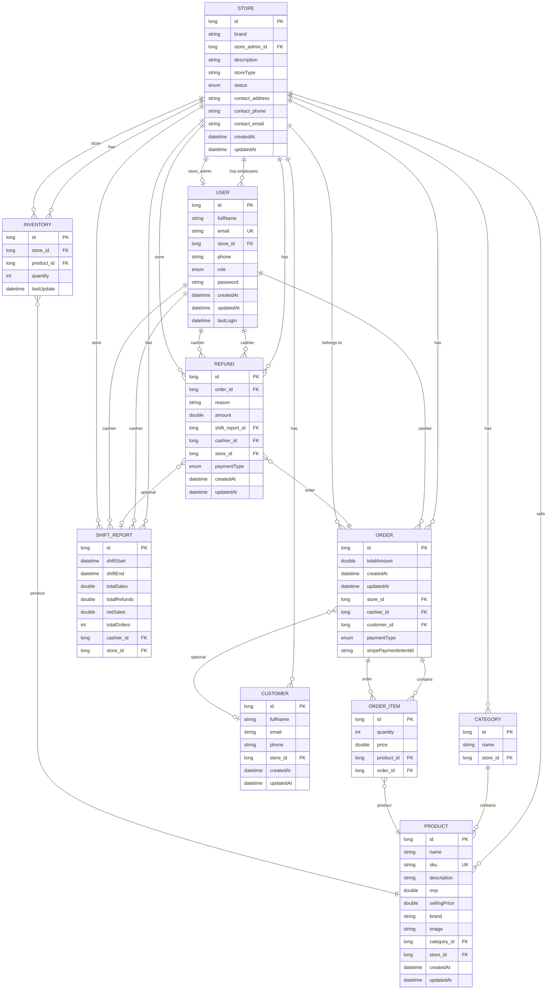

# POS System – Entity Relationship Diagram & API Docs

This document describes the database structure and relationships for the single-store POS system.

---

## API documentation (Swagger / OpenAPI)

After starting the application:

- **Swagger UI**: [http://localhost:5000/swagger-ui.html](http://localhost:5000/swagger-ui.html) (or `/swagger-ui/index.html`)
- **OpenAPI JSON**: [http://localhost:5000/v3/api-docs](http://localhost:5000/v3/api-docs)

To call protected endpoints from Swagger UI:

1. Call **POST /auth/login** with body `{ "email": "...", "password": "..." }`.
2. Copy the `jwt` from the response.
3. Click **Authorize**, enter the JWT (or `Bearer <your-jwt>`), then **Authorize**.
4. You can then try any `/api/**` endpoint.

---

## Mermaid ER diagram

---

## Relationship summary

| From       | To           | Type        | Description |
|-----------|--------------|------------|-------------|
| **Store** | User         | 1 : N      | Store has many users (owner + staff). |
| **Store** | User         | 1 : 1      | One user is the store admin (`store_admin_id` on Store). |
| **Store** | Category     | 1 : N      | Categories belong to a store. |
| **Store** | Product      | 1 : N      | Products belong to a store. |
| **Store** | Customer     | 1 : N      | Customers can be scoped to a store. |
| **Store** | Order        | 1 : N      | Orders are placed at the store. |
| **Store** | Inventory    | 1 : N      | Inventory is per store (and product). |
| **Store** | Refund       | 1 : N      | Refunds are tied to the store. |
| **Store** | ShiftReport  | 1 : N      | Shift reports are per store. |
| **User**  | Order        | 1 : N      | User (cashier) creates many orders. |
| **User**  | Refund       | 1 : N      | User (cashier) processes refunds. |
| **User**  | ShiftReport  | 1 : N      | User (cashier) has shift reports. |
| **Category** | Product   | 1 : N      | Products belong to a category. |
| **Order** | OrderItem    | 1 : N      | Order has many line items. |
| **Order** | Customer     | N : 1 opt  | Order can optionally link to a customer. |
| **OrderItem** | Product  | N : 1      | Each line item references a product. |
| **OrderItem** | Order     | N : 1      | Each line item belongs to one order. |
| **Refund** | Order       | N : 1      | Refund is for one order. |
| **Refund** | ShiftReport | N : 1 opt  | Refund can be linked to a shift report. |

---

## Enums

- **UserRole**: `ROLE_OWNER`, `ROLE_STAFF`
- **StoreStatus**: `ACTIVE`, `PENDING`, `BLOCKED`
- **PaymentType**: `CASH`, `UPI`, `CARD`

---

## Notes

- **Store** contact fields (address, phone, email) are stored on the Store table via the embedded `StoreContact` type.
- **Order.stripePaymentIntentId** is set when payment is made by card via Stripe; used for refunds.
- **ShiftReport** has transient/computed fields (e.g. payment summaries); `topSellingProducts` and `recentOrders` may use join tables depending on JPA configuration.
- **Single store**: There is no Branch; all relations are Store-centric.
